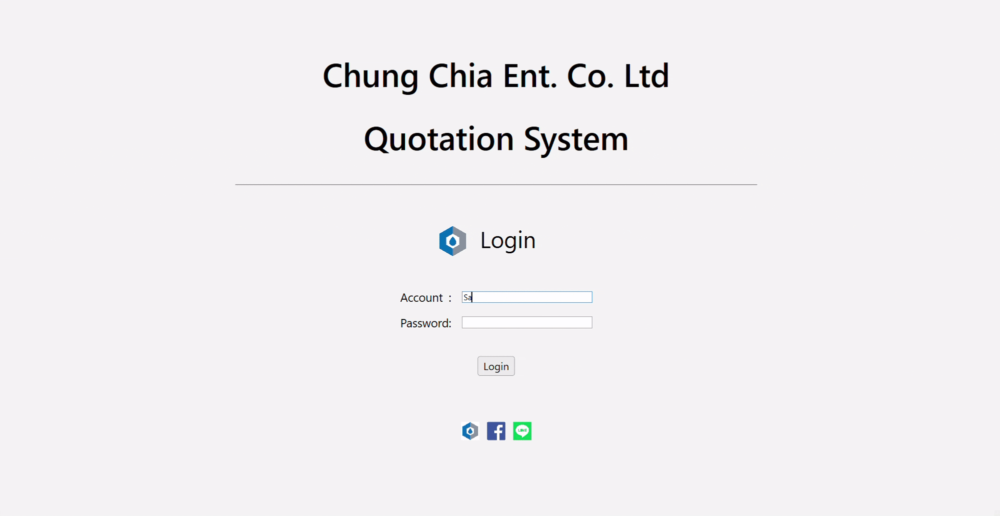
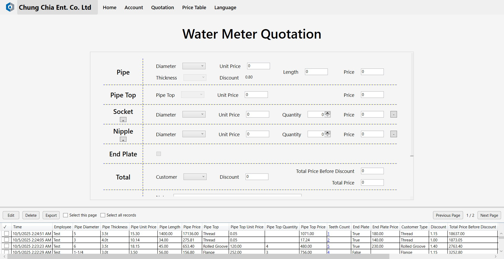
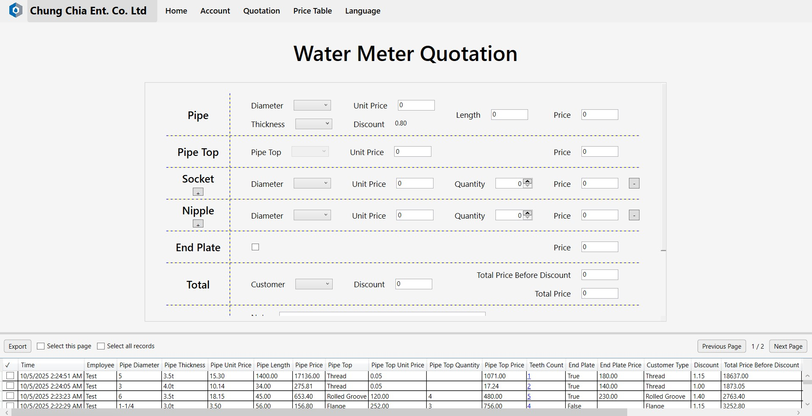
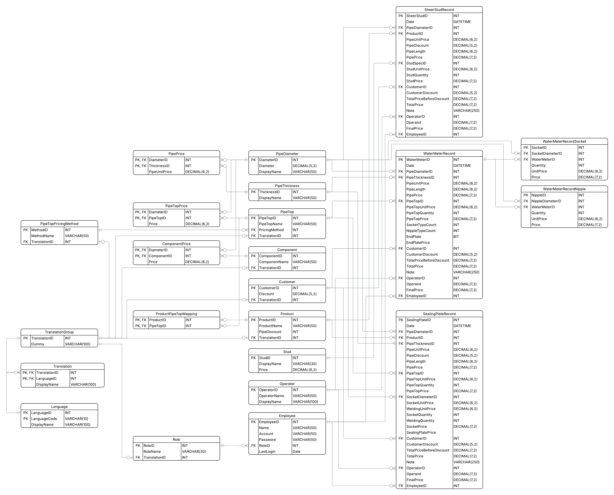

# Plumbing Store Quotation System
A **WPF-based desktop quotation system** designed to minimize manual errors and improve workflow efficiency. 

Built with **.NET Core**, **Entity Framework Core**, and **MS SQL Server**, the application follows **Clean Architecture** with an **MVVM pattern**, incorporating **layered design principles** and localization support for multi-language use.

## Features
- **Role-based access**: Separate permissions for **administrators** and **standard users** (employees).
  <p align="left">
  
  </p>
  
  - Admin has access to **edit, create, and delete user**.
    <p align="center" >
    <table>
      <tr>
        <td>
          <figure>
            
            <br>
            <figurecaption>Admin</figurecaption>
          </figure>
        </td>
        <td>
          <figure>
            
            <br>
            <figurecaption>User</figurecaption>
          </figure>
        </td>
      </tr>
    </table>
  </p>
  
  - Admin has access to **edit, delete, and export records**.
    <p align="center" >
    <table>
      <tr>
        <td>
          <figure>
            
            <br>
            <figurecaption>Admin</figurecaption>
          </figure>
        </td>
        <td>
          <figure>
            
            <br>
            <figurecaption>User</figurecaption>
          </figure>
        </td>
      </tr>
    </table>
  </p>
  
  
- **Quotation operation**:
  - Generate quotations by entering input values.
  - Options and prices **update dynamically** based on selected products and previous choices.
  <p align="left">
  
  </p>
- **Quotation history**:
  - **Editing and deletion** on past quotation records are restricted to administrators.
    <p align="left">
    
    </p>

  - **View and export** past quotation records are available to all users.
    <p align="left">
    
    </p>
    
- **Price table management** (in progress): Allows administrators to update product options and pricing.
- **Localization support**: Provides a multilingual interface, currently supporting **English (EN-US)** and **Traditional Chinese (ZH-TW)**.
  <p align="left">
  
  </p>
  

## Technical Stack
- **Frameworks & UI**: .NET Core WPF with XAML
- **Architecture**: Clean Architecture with layered design and MVVM pattern
- **Database**: SQL Server with Entity Framework Core
- **Practices**: Exception handling, asynchronous operations
- **Tools**: Git for version control, Visual Studio for development

*“System Architecture” diagram/section (even a simple ASCII sketch or description), so recruiters can visualize how your layers (UI, Application, Domain, Infrastructure) interact

## System Design & Implementation Details
- **Layered architecture**: Presentation, Application, Data Access layers
- **UI consistency**: UserControls and templates for reusable views
- **MVVM**: Data binding with CommunityToolkit.Mvvm
- **Localization**:
  - Static content via ResourceDictionary + localization extension
  - Dynamic content stored in database
- **Abstraction**: Interfaces and services to enforce architectural boundaries
- **Database**: Normalized relational schema with ER diagram
<p align="center">
  
</p>

## Getting Started
### Prerequisites
- .NET 8 SDK
- Visual Studio 2022 + with WPF workload
- SQL Server

### Setup
1. **Clone the repository**
  ```sh  
  git clone https://github.com/username/quotation-system.git
  cd quotation-system
  ```
2. **Configure database connection**
   - Open the solution in Visual Studio.
   - Update the SQL Server connection string in appsettings.json.
3. **Apply migrations**
  ```sh  
  dotnet ef database update
  ```
  This will create the database schema automatically.
4. **Run**
  - Press F5 in Visual Studio
  - Or run from CLI:
  ```sh
  dotnet run --project QuotationSystem
  ```
